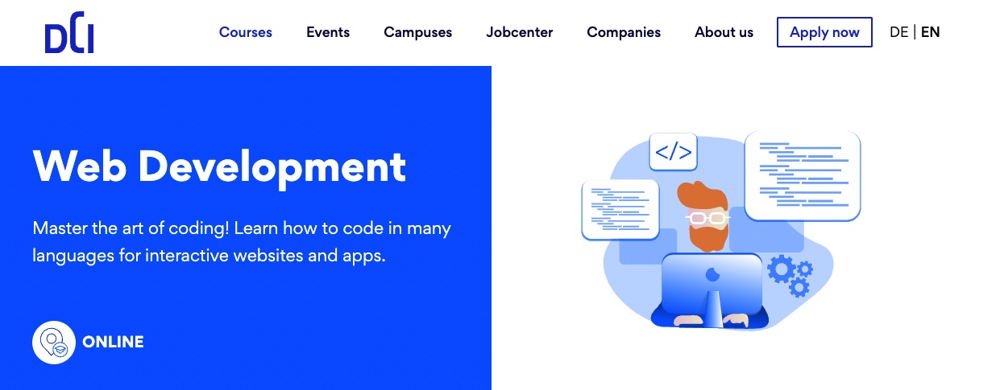

# live-coding

<<<<<<< HEAD
## This is my repository related to the Web Developer Course at Digital Career Institute

[][dci]

[dci]: https://digitalcareerinstitute.org/courses/web-development-course

=======
>>>>>>> 7199261ef86f6bd29fb423df1ecdae1144164651
## Important Basics

1. Git and Github
   [101](./dec/??.md)
1. Upstream
   [and more](./dec/??.md)

## Class Topics

1. Go to the following link to find the BDL topics with the dates:

   ## [BDL](BDL.md)

2. Go to the following link to find the UIB topics with the dates:
   ## [HTML & CSS](UIB.md)
